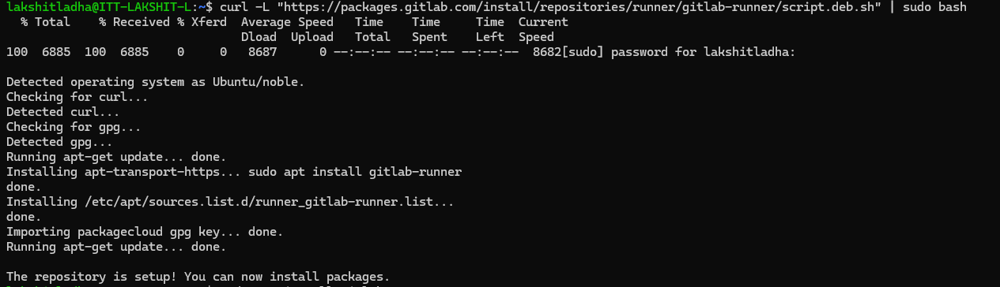
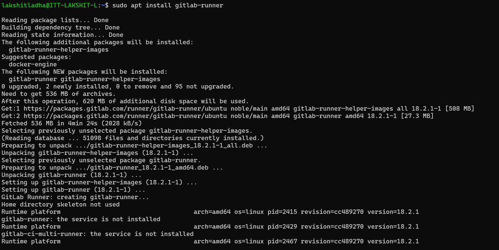
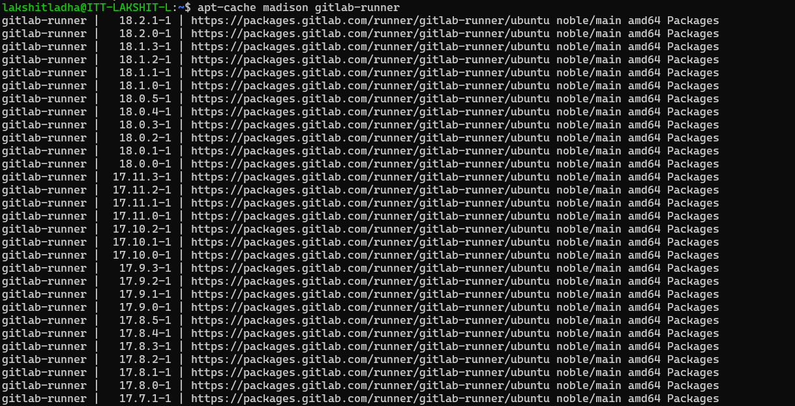
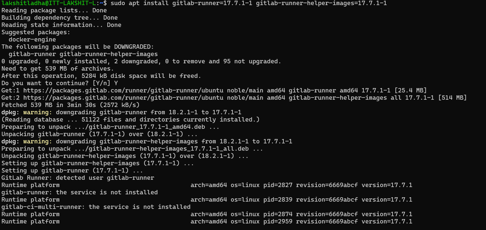
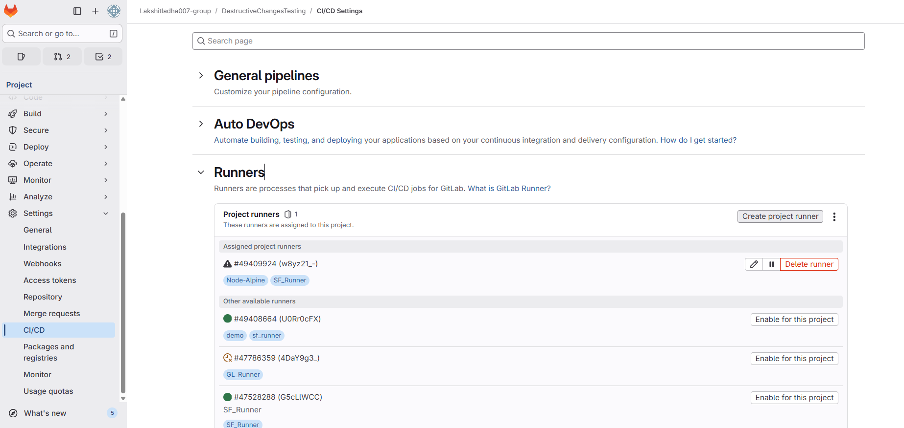
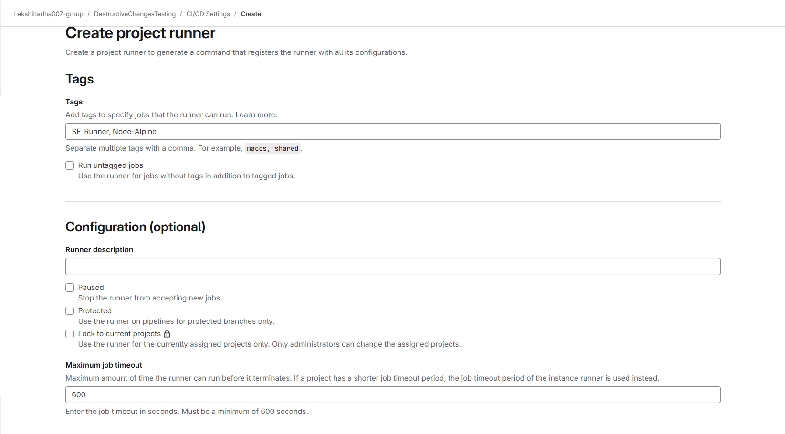
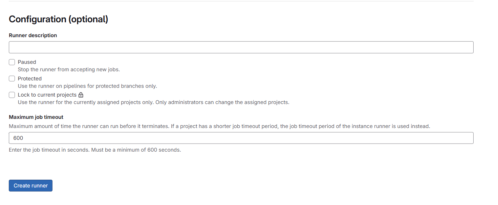
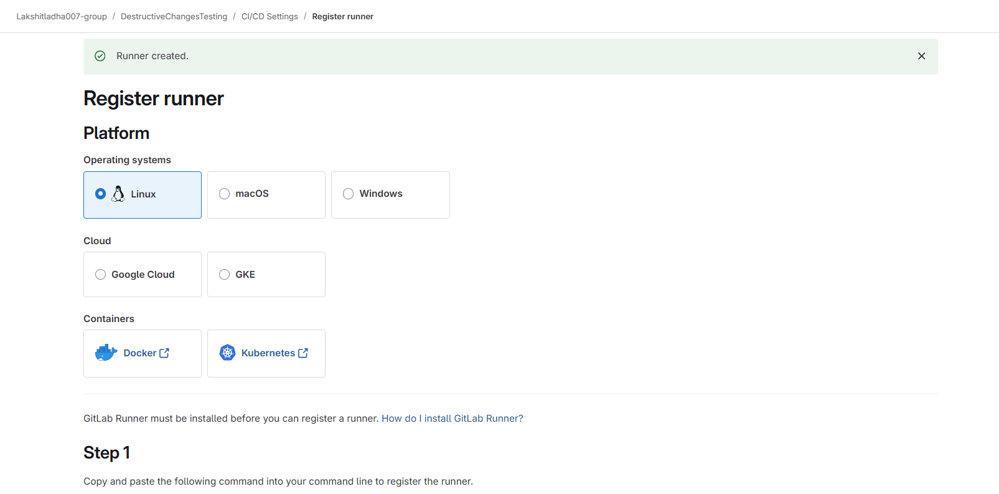
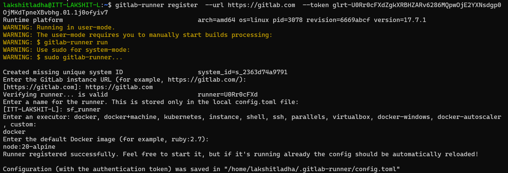
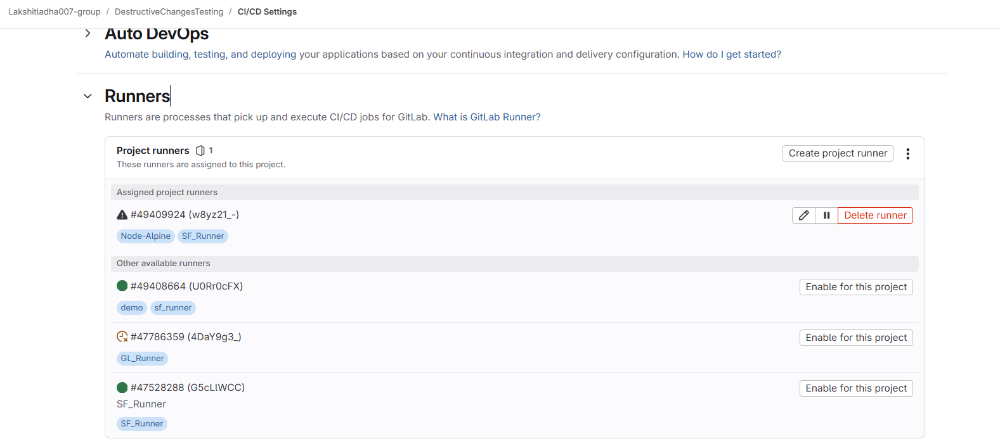

# 🚀 Steps to Set Up GitLab Runner on VM

### 1. Install GitLab Runner inside VM: <br>
reference doc: https://docs.gitlab.com/runner/install/linux-repository/
Connect to your VM terminal and run:

#### Add GitLab official repo
```bash
curl -L https://packages.gitlab.com/install/repositories/runner/gitlab-runner/script.deb.sh | sudo bash
```


#### Install GitLab runner
It installs latest Gitlab Version
```bash
sudo apt-get install gitlab-runner
```


#### List all installable versions
```bash
apt-cache madison gitlab-runner
```


#### Install a Specific Version (Runner + Helper Images)
```bash
sudo apt install gitlab-runner=17.7.1-1 gitlab-runner-helper-images=17.7.1-1
```


### 2. (Optional) Install Docker inside VM if not installed
If you plan to use the Docker executor, Docker must be available inside VM.<br>
Install Docker natively inside WSL:<br>
```bash
sudo apt update
sudo apt install docker.io -y
sudo usermod -aG docker $USER
newgrp docker
```
##### To verify docker in working fine or not, run:<br>
```bash
docker run hello-world
```

### 3. Register the runner
Steps to get the token:<br>
i> Go to your GitLab project, now:<br>
    a> Settings → CI/CD → Runners section.<br>
    b> Click Expand under Runners<br>
    c> select "create project runners".<br>
    
    d> and add runner details.<br>
    
    e> click on "Create runner" button at the bottom.<br>
    

ii> Now, choose platform: (Choose LINUX under Operating Systems, since we are using LINUX VM)<br>


iii> Now, run the following commands on VM terminal as shown on UI after choosing the platform.<br>
Register the runner by running the step-1 command in VM, and fill the following details as prompted:

Copy the "Registration Token"

| Prompt                   | Example Response                                           |
| ------------------------ | -----------------------------------------------------------|
| GitLab instance URL      | `https://gitlab.com`                                       |
| Enter runner name        |  Name for the runner stored in the local config.toml file. |
| Enter an executor        |  docker                                                    |
| Default docker Image     |  node:20-alpine                                            |

### 4. Start GitLab Runner
```bash
sudo gitlab-runner start
```
To make it run in the background after reboot:<br>
```bash
sudo systemctl enable gitlab-runner
```

### 5. Verify Runner on GitLab UI
Go to your project → Settings → CI/CD → Expand Runners → You should see your runner listed.


## Tips
##### 1.To see logs:
```bash
sudo gitlab-runner status
sudo gitlab-runner run
sudo gitlab-runner list
```
##### 2.To stop the runner:
```bash
sudo gitlab-runner stop
```